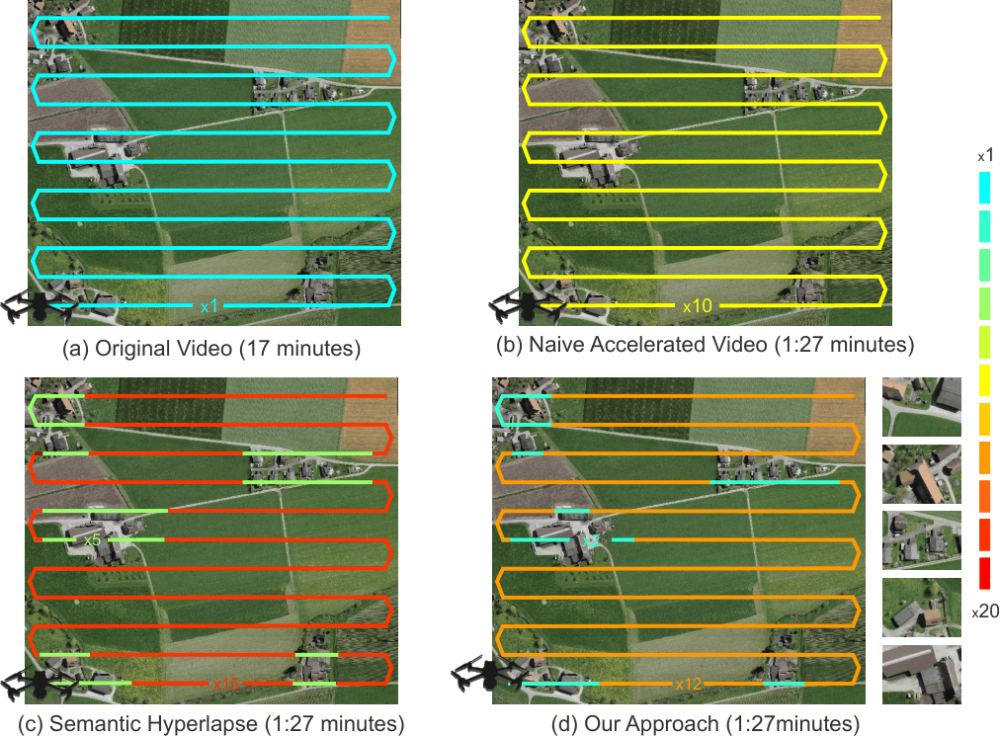
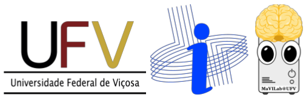

# Orthophoto-Driven Semantic Hyperlapse and Video Summarization for Aerial Monitoring

This repository contains the implementation of our paper **Orthophoto-Driven Semantic Hyperlapse and Video Summarization for Aerial Monitoring**, published at the *Conference on Graphics, Patterns and Images (SIBGRAPI), 2026*.

We present an open-source framework for aerial vehicle-based monitoring in rural areas, addressing two complementary tasks: semantic hyperlapse and video summarization. Our pipeline maps spatial information from semantic orthophotos back to the temporal video sequence, generating a coherent semantic profile that guides frame selection and temporal speed variations.



If you find this code useful for your research, please cite the paper:

```bibtex
@INPROCEEDINGS{Moreira_2026_SIBGRAPI,
  author={Gabriel Moreira and Luísa Ferreira and Bruno Sette and Thiago Gomes and Michel Silva},
  booktitle={2026 Conference on Graphics, Patterns and Images (SIBGRAPI)},
  title={Orthophoto-Driven Semantic Hyperlapse and Video Summarization for Aerial Monitoring},
  year={2026},
  keywords={Semantic Hyperlapse; Video Summarization; Orthophoto; Aerial Monitoring; UAV},
}
```

## Requirements

- [MicMac](https://github.com/micmacign/micmac) (Adapted Docker Image provided by us)
- C++17 Compiler (GCC/Clang)
- GDAL Library
- Python 3
- [Semantic Musical Hyperlapse](https://github.com/MaVILab-UFV/SemanticMusicalHyperlapse_SIBGRAPI_2024) (for final frame acceleration)

## Getting Started

You can clone this repository and ensure you have all C++ dependencies (like GDAL) installed. Before running the heuristic pipeline, you will need to process your drone footage to generate the required global spatial representation.

## Pipeline: From Aerial Footage to Semantic Summaries

### 1 - Orthophoto Generation (MicMac)

The first prerequisite step is generating a global spatial and semantic representation (orthophoto) of the monitored area. We use the open-source photogrammetry software MicMac for this process. In our method we use spartial footprints to map the semantic information back to the video timeline and the original Micmac pipeline does not provide this information. Therefore, we provide a customized MicMac Docker image that outputs the required spatial footprints for each frame. All you need to do is set the argument GenMasks=True in the Tawny stage of the MicMac pipeline.
Pull and run our customized MicMac Docker image to process your raw aerial images into an orthophotomosaic:

```bash
docker pull eugabrielmm/micmac-tcc:latest

```
For a step-by-step guide on generating orthophotos with MicMac, see:
- [Official MicMac Documentation](https://github.com/micmacIGN/micmac)

### 2 - Spatial Footprints and Semantic Profiling

With the semantic orthophoto generated, the pipeline maps the spatial information back to the video timeline. The input data for this stage consists of the **semantic orthophoto** and the **spatial footprints** (coordinate masks representing the camera's projection on the ground for each frame).

Run the pipeline to evaluate spatial centrality via Gaussian decay and generate the semantic profiles:

```bash
./semantic_pipeline --ortho="data/Orthophotomosaic.tif" --frames_dir="data/OrthoByFrameMasks/" --out_dir="results/" --r_min=255 --r_max=255 --g_min=69 --g_max=69 --b_min=0 --b_max=0
```

This step outputs the required semantic profiles (e.g., `semantic_profile_normalized.txt`) and handles the Set Cover heuristic for the video summarization task.

semantic_profile_normalized.txt contains the normalized scores of the semantic importance for each frame, which will be used in the next step for frame acceleration. For the video summarization task you can use the scores of the Set Cover heuristic to select the most relevant frames for your summary video. In our experiments, we used the top 10 of the frames with the highest scores to generate the summary video.

### 3 - Frame Acceleration (Semantic Hyperlapse)

To generate the final hyperlapse video, we leverage the processing engine from a third-party work, the [Semantic Musical Hyperlapse (SIBGRAPI 2024)](https://github.com/MaVILab-UFV/SemanticMusicalHyperlapse_SIBGRAPI_2024).

In this integration, the audio-based orientation signal from the original 2024 framework is completely replaced by the rural semantic profile ($P$) obtained in Step 2. This profile acts as the primary guiding importance signal, controlling the frame selection and dictating the temporal speed variations to maintain the visibility of objects of interest.

## Authors

| **Gabriel Moreira** | **Luísa Ferreira** | **Bruno Sette** | **Thiago Gomes** | **Michel Silva** |
| --- | --- | --- | --- | --- |
| MSc. Student¹ | Researcher² | MSc. Student¹ | MSc. Student¹ | Assistant Professor¹ |
| [gabriel.m.marques@ufv.br](mailto:gabriel.m.marques@ufv.br) | [s26ldeso@uni-bonn.de](mailto:s26ldeso@uni-bonn.de) | [bruno.sette@ufv.br](mailto:bruno.sette@ufv.br) | [thiago.luange@ufv.br](mailto:thiago.luange@ufv.br) | [michel.m.silva@ufv.br](mailto:michel.m.silva@ufv.br) |

¹Departamento de Informática, Universidade Federal de Viçosa (UFV), Viçosa-MG, Brazil  
²University of Bonn, Bonn, Germany

## Laboratory



**MaVILab:** Machine Vision and Intelligence Laboratory  
[https://mavilab-ufv.github.io/](https://mavilab-ufv.github.io/)


### Enjoy it! 
